# QA Director

**The fastest way to build a complete, reliable E2E test suite — powered by Playwright MCP and Claude Code.**

QA Director is an AI-powered CLI tool that helps you go from **natural language → fully integrated Playwright test** in seconds. No brittle codegen. No manual test writing. No wrestling with auth, roles, or CI setup.

Just describe the test. We’ll handle the rest.\

## Why QA Director?

- 🧠 **Natural Language to Test Code**  
  Describe what you want to test in plain English. QA Director spins up a browser, runs the flow, and generates a clean, stable Playwright test — using Claude Code for intelligent placement and structure. **Works seamlessly even if you already have a Playwright E2E test suite set up.**

- ⚙️ **Zero-Config Setup**  
  Don’t know Playwright? You don’t have to. QA Director auto-detects your config, sets up test folders, handles environment variables, and wires up GitHub Actions — all out-of-the-box.

- 🔐 **Auth + Roles Handled for You**  
  Managing multiple users or sessions? QA Director records your login flows using Playwright codegen and stores role-based auth state — no extra code or boilerplate needed.

- 🔒 **Smart Environment Variable Detection**  
  Automatically scrubs and replaces sensitive values like tokens or emails with environment-safe variables.

- 🚀 **CI-Ready from Day 1**  
  Comes with GitHub Actions E2E workflows pre-configured. Just push and your tests run.

## 🧩 How It Works

```mermaid
flowchart LR
  A["📝 Describe Test<br/>in English"] --> B["🌐 Browser<br/>Automation"]
  B --> C["🎭 Live Testing<br/>with Playwright"]
  C --> D["🧠 AI Analysis<br/>& Code Gen"]
  D --> E["✨ Generate<br/>Stable Tests"]
  E --> F["📁 Organize by<br/>Role & Folder"]
  F --> G["🚀 Auto-Deploy<br/>to CI/CD"]

  classDef default fill:#2d3748,stroke:#4a5568,stroke-width:2px,color:#fff
  classDef highlight fill:#3182ce,stroke:#2b6cb0,stroke-width:2px,color:#fff

  class A,G highlight
```



1. **Describe your test**  
   Run `qa-director generate` and write your scenario in plain English.

2. **Live browser execution**  
   A Chromium instance runs the flow using **Playwright MCP**, capturing DOM actions and screenshots.

3. **Claude Code powers generation**  
   **Claude Code SDK** converts the flow into a clean, reliable Playwright test, and figures out where in your codebase to put it.

4. **Zero setup**  
   Tests are placed in the right folder with auth, roles, and env vars handled automatically.

5. **CI-ready**  
   GitHub Actions is pre-configured—push your code and the tests just run.

---

## Installation

```bash
npm install qa-director
```

## Quick Start

### 1. Initialize QA Director

```bash
npx qa-director init
```

This will:

- Detect your Playwright configuration
- Set up authentication directories
- Create environment files
- Configure GitHub Actions (optional)
- Generate initial setup files

### 2. Set up a login role

```bash
npx qa-director login user
```

This will:

- Launch Playwright codegen to record your login flow
- Detect and replace sensitive data with environment variables
- Update setup files and Playwright configuration
- Create role-specific test folders (optional)

### 3. Generate tests

```bash
npx qa-director generate --role user "Test user can create a new post"
```

This will:

- Run browser automation with your specified role
- Use AI to generate a complete Playwright test
- Add the test to your codebase in the appropriate location

## Commands

### `qa-director init`

Initialize qa-director in your current project.

### `qa-director login <role>`

Set up authentication for a specific role.

**Arguments:**

- `<role>` - Role name

**Examples:**

```bash
qa-director login admin
qa-director login user --refresh
qa-director login --role admin
qa-director login --role user --refresh
```

### `qa-director generate --role <role> "<description>"`

Generate an E2E test using AI.

**Arguments:**

- `<description>` - Natural language description of what to test

**Examples:**

```bash
qa-director generate --role user "Test user can update their profile"
qa-director generate --role admin "Test admin can delete a user account"
```

### `qa-director eject`

Remove qa-director files and configurations from your project.

**Examples:**

```bash
qa-director eject                    # Remove all qa-director files
qa-director eject --role user        # Remove only the 'user' role
qa-director eject --dry-run          # Preview what would be removed
qa-director eject --force            # Skip confirmation prompt
```

**Role-specific ejection includes:**

- Role files (storage state, test folders)
- Role entry from qa-director.config.ts
- Role configuration from Playwright config (with AI assistance)
- Role login flow from auth.setup.ts (with AI assistance)
- Role-specific environment variables
- Role secrets from GitHub Actions workflow

## Configuration

QA Director creates a `qa-director.config.ts` file in your project root:

```typescript
import { QADirectorConfig } from "qa-director";

const config: QADirectorConfig = {
  baseURL: "http://localhost:3000",
  testDir: "./tests",
  roles: [
    {
      name: "user",
      storagePath: "./playwright/.auth/storageState.user.json",
      testMatch: ["./tests/user/**/*.{test,spec}.{js,ts}"],
      envVars: ["QA_USER_EMAIL", "QA_USER_PASSWORD"],
    },
  ],
  authDir: "playwright/.auth",
  githubActions: {
    enabled: true,
    path: ".github/workflows/qa-director.yml",
  },
  setup: {
    path: "./tests/auth.setup.ts",
    enabled: true,
  },
  envDir: ".env.qa",
  playwrightConfig: "playwright.config.ts",
};

export default config;
```

## Environment Variables

Create a `.env.qa` file with your configuration:

```bash
# Required
ANTHROPIC_API_KEY=your_anthropic_api_key_here

# Auto-generated based on detected login flows
QA_USER_EMAIL=user@example.com
QA_USER_PASSWORD=your_password_here
QA_ADMIN_EMAIL=admin@example.com
QA_ADMIN_PASSWORD=admin_password_here
```

## Project Structure

After initialization, your project will have:

```
your-project/
├── qa-director.config.ts       # QA Director configuration
├── .env.qa                     # Environment variables
├── .env.qa.example            # Environment template
├── tests/
│   ├── auth.setup.ts          # Authentication setup
│   ├── user/                  # User role tests (optional)
│   └── admin/                 # Admin role tests (optional)
├── playwright/.auth/          # Authentication states
│   ├── storageState.user.json
│   └── storageState.admin.json
└── .github/workflows/
    └── qa-director.yml        # GitHub Actions workflow
```

## Role Management

QA Director supports multiple roles with separate authentication states:

- **Role Isolation**: Each role has its own storage state and test folder
- **Environment Variables**: Automatically detected and managed per role
- **Test Organization**: Optional role-specific folders for better organization
- **Playwright Integration**: Automatic project configuration for each role

## GitHub Actions

QA Director automatically sets up GitHub Actions for E2E testing:

```yaml
name: QA Director E2E Tests
on:
  push:
    branches: [main, develop]
  pull_request:
    branches: [main, develop]

jobs:
  test:
    runs-on: ubuntu-latest
    steps:
      - uses: actions/checkout@v4
      - uses: actions/setup-node@v4
      - run: npm ci
      - run: npx playwright install --with-deps chromium
      - run: npx playwright test
        env:
          ANTHROPIC_API_KEY: ${{ secrets.ANTHROPIC_API_KEY }}
          QA_USER_EMAIL: ${{ secrets.QA_USER_EMAIL }}
          QA_USER_PASSWORD: ${{ secrets.QA_USER_PASSWORD }}
```

## Requirements

- Node.js 18 or later
- Playwright project
- Anthropic API key

## Browser Support

QA Director focuses on Chromium for consistent and reliable testing across environments.

## Contributing

1. Fork the repository
2. Create a feature branch
3. Make your changes
4. Add tests if applicable
5. Submit a pull request

## License

MIT License - see LICENSE file for details

## Support

- GitHub Issues: Report bugs and request features
- Documentation: See inline help with `qa-director <command> --help`

## Why Claude Code?

Claude Code offers maximum flexibility by adapting to different development team setups. It intelligently analyzes your repository to determine the best location for new tests, ensuring seamless integration with your existing test suite.
